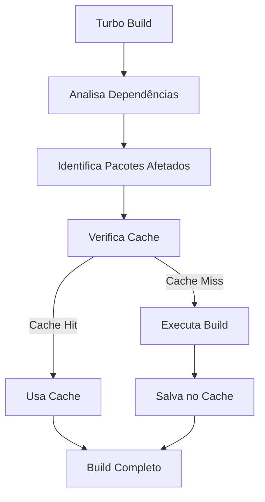

# Monorepo vs Polyrepo - Análise Completa

## 📋 Visão Geral

Esta análise compara as abordagens de organização de código: **Monorepo** (com Turborepo) versus **Polyrepo** (múltiplos repositórios), com foco na criação de bibliotecas de componentes.

## 🏗️ O que é Monorepo?

**Monorepo** (Monolithic Repository) é uma estratégia de versionamento onde múltiplos projetos/pacotes são mantidos em um único repositório.

### Características

- Múltiplos pacotes em um repositório
- Dependências compartilhadas
- Versionamento coordenado
- Builds otimizados
- Refatorações simplificadas

### Exemplos

- Google (maior monorepo do mundo)
- Facebook/Meta
- Microsoft
- Babel
- React
- Material-UI

## 🔄 O que é Polyrepo?

**Polyrepo** (Multiple Repositories) é a abordagem tradicional onde cada projeto/pacote tem seu próprio repositório.

### Características

- Um repositório por pacote
- Dependências independentes
- Versionamento independente
- Builds isolados
- Refatorações complexas

## ⚖️ Comparativo Detalhado

### 1. Organização e Estrutura

#### Monorepo (Turborepo)

**Prós:**
- ✅ Organização clara por contexto
- ✅ Compartilhamento de código facilitado
- ✅ Visão unificada do projeto
- ✅ Refatorações entre pacotes simplificadas
- ✅ Padrões consistentes

**Contras:**
- ❌ Curva de aprendizado inicial
- ❌ Estrutura inicial mais complexa
- ❌ Pode ficar grande e confuso se mal organizado

**Estrutura típica:**
```
lib-verniz/
├── packages/
│   ├── components/
│   ├── utils/
│   └── theme/
├── apps/
│   └── docs/
└── shared/
```

#### Polyrepo

**Prós:**
- ✅ Isolamento total entre projetos
- ✅ Repositórios independentes
- ✅ Permissões granulares por repositório

**Contras:**
- ❌ Duplicação de código
- ❌ Sincronização manual entre repos
- ❌ Refatorações complexas
- ❌ Overhead de gerenciamento

## 📊 Comparativo por Aspecto

### Gerenciamento de Dependências

| Aspecto | Monorepo | Polyrepo |
|---------|----------|----------|
| **Compartilhamento** | ✅ Automático (workspaces) | ❌ Manual (publicação) |
| **Atualização** | ✅ Centralizada | ❌ Repetitiva |
| **Duplicação** | ✅ Evitada | ❌ Frequente |
| **Resolução** | ✅ Unificada | ❌ Independente |

**Exemplo Monorepo:**
```json
// packages/button/package.json
{
  "dependencies": {
    "@verniz/utils": "*",  // Workspace interno
    "@verniz/theme": "*"
  }
}
```

**Exemplo Polyrepo:**
```json
// Precisa publicar e instalar
{
  "dependencies": {
    "@verniz/utils": "^1.0.0",  // Versão específica
    "@verniz/theme": "^1.0.0"
  }
}
```

### Build e Performance

| Aspecto | Monorepo (Turborepo) | Polyrepo |
|---------|---------------------|----------|
| **Cache** | ✅ Inteligente (Turborepo) | ❌ Limitado |
| **Builds incrementais** | ✅ Automáticos | ❌ Manuais |
| **Paralelização** | ✅ Automática | ⚠️ Limitada |
| **Reutilização** | ✅ Alta | ❌ Baixa |

**Performance típica:**
- **Monorepo (Turborepo)**: Primeira build ~2-3min, incrementais ~10-30s
- **Polyrepo**: Cada repo ~1-2min, sem cache compartilhado

### Versionamento e Publicação

| Aspecto | Monorepo | Polyrepo |
|---------|----------|----------|
| **Coordenação** | ✅ Automática (Changesets) | ❌ Manual |
| **CHANGELOG** | ✅ Unificado | ❌ Fragmentado |
| **Dependências internas** | ✅ Atualizadas automaticamente | ❌ Manual |
| **Publicação** | ✅ Coordenada | ❌ Independente |

### Desenvolvimento e DX

| Aspecto | Monorepo | Polyrepo |
|---------|----------|----------|
| **Hot reload** | ✅ Entre pacotes | ❌ Apenas local |
| **Refatorações** | ✅ Em massa | ❌ Repetitivas |
| **Testes** | ✅ Coordenados | ❌ Isolados |
| **Linting** | ✅ Unificado | ❌ Repetitivo |

### Manutenção

| Aspecto | Monorepo | Polyrepo |
|---------|----------|----------|
| **Atualização de dependências** | ✅ 1-2h (todos) | ❌ 4-8h (cada repo) |
| **Refatoração grande** | ✅ 2-4h | ❌ 8-16h |
| **Adicionar componente** | ✅ 5min (Hygen) | ❌ 2-4h (setup repo) |
| **Correção de bug** | ✅ 1-2h | ❌ 4-8h (múltiplos repos) |

## 🎯 Turborepo - O que é?

**Turborepo** é um build system de alto desempenho para JavaScript e TypeScript, otimizado para monorepos.

### Características

- ✅ Cache inteligente
- ✅ Builds incrementais
- ✅ Paralelização automática
- ✅ Task orchestration
- ✅ Remote caching (opcional)

### Configuração Básica

```json
// turbo.json
{
  "$schema": "https://turbo.build/schema.json",
  "tasks": {
    "build": {
      "outputs": ["dist/**"],
      "dependsOn": ["^build"]
    },
    "test": {
      "cache": false
    },
    "lint": {
      "cache": false
    }
  }
}
```

### Fluxo de Build



## 📈 Métricas Comparativas

### Tempo de Setup

| Tarefa | Monorepo | Polyrepo |
|--------|----------|----------|
| Setup inicial | 4-8h | 1-2h |
| Adicionar pacote | 5min | 2-4h |
| Configurar CI/CD | 2-4h | 4-8h (cada repo) |

### Performance de Build

| Cenário | Monorepo (Turborepo) | Polyrepo |
|---------|---------------------|----------|
| Primeira build | 2-3min | 1-2min × N repos |
| Build incremental | 10-30s | 1-2min × N repos |
| Cache hit | 5-10s | N/A |

### Manutenção Mensal

| Atividade | Monorepo | Polyrepo |
|-----------|----------|----------|
| Atualizar dependências | 1-2h | 4-8h |
| Refatorações | 2-4h | 8-16h |
| Correções | 1-2h | 4-8h |
| **Total** | **4-8h** | **16-32h** |

## ✅ Recomendação: Monorepo com Turborepo

### Justificativas

1. **Escalabilidade**: Fácil adicionar novos componentes
2. **Performance**: Builds otimizados com cache
3. **Manutenção**: 4x menos tempo que polyrepo
4. **Consistência**: Padrões unificados
5. **Produtividade**: Desenvolvimento mais rápido

### Quando Usar Monorepo

✅ **Ideal para:**
- Bibliotecas de componentes
- Design systems
- Múltiplos pacotes relacionados
- Times trabalhando em múltiplos pacotes
- Necessidade de versionamento coordenado

❌ **Evitar quando:**
- Projeto único e pequeno
- Pacotes completamente independentes
- Times diferentes por pacote (sem coordenação)
- Necessidade de permissões muito granulares

### Quando Usar Polyrepo

✅ **Ideal para:**
- Microserviços independentes
- Produtos completamente separados
- Times diferentes sem coordenação
- Necessidade de permissões isoladas

❌ **Evitar quando:**
- Pacotes relacionados
- Compartilhamento de código frequente
- Versionamento coordenado necessário

## 🚀 Próximos Passos

1. Configurar Turborepo
2. Estruturar workspaces
3. Configurar builds
4. Implementar CI/CD

---

**Conclusão**: Para a biblioteca Verniz, **Monorepo com Turborepo** é a escolha recomendada devido à escalabilidade, performance e facilidade de manutenção.

