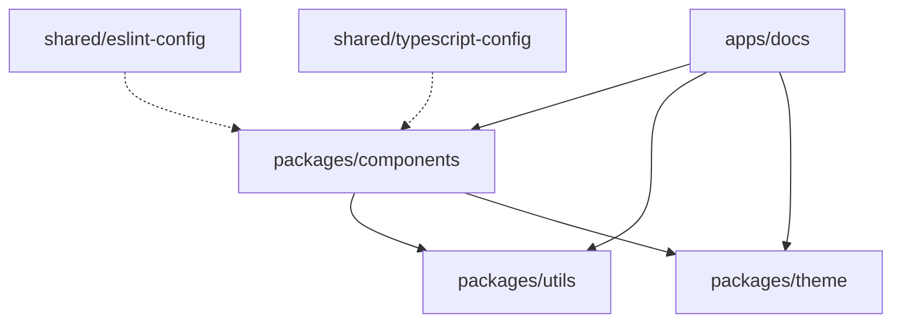

# Estrutura do Projeto - Biblioteca Verniz

## 📁 Estrutura Proposta

```
lib-verniz/
├── .github/
│   ├── workflows/              # GitHub Actions
│   │   ├── release.yml
│   │   ├── test.yml
│   │   └── build.yml
│   └── pull_request_template.md
│
├── .changeset/                 # Changesets
│   ├── config.json
│   └── [arquivos de changeset]
│
├── apps/
│   └── docs/                  # Storybook
│       ├── .storybook/
│       ├── src/
│       └── package.json
│
├── packages/
│   ├── components/            # Componentes shadcn customizados
│   │   ├── button/
│   │   │   ├── src/
│   │   │   │   ├── Button.tsx
│   │   │   │   ├── Button.styles.ts
│   │   │   │   ├── Button.spec.tsx
│   │   │   │   ├── Button.stories.tsx
│   │   │   │   └── index.tsx
│   │   │   ├── package.json
│   │   │   ├── tsconfig.json
│   │   │   └── tsup.config.ts
│   │   ├── input/
│   │   └── ...
│   │
│   ├── utils/                 # Utilitários compartilhados
│   │   ├── src/
│   │   │   ├── cn.ts          # className utility
│   │   │   └── index.ts
│   │   ├── package.json
│   │   └── tsup.config.ts
│   │
│   └── theme/                  # Design tokens
│       ├── src/
│       │   ├── colors.ts
│       │   ├── spacing.ts
│       │   └── index.ts
│       ├── package.json
│       └── tsup.config.ts
│
├── shared/
│   ├── eslint-config/         # Configurações ESLint
│   │   ├── base.js
│   │   ├── react.js
│   │   └── package.json
│   │
│   └── typescript-config/      # Configurações TypeScript
│       ├── base.json
│       ├── react-library.json
│       └── package.json
│
├── _templates/                 # Templates Hygen
│   └── component/
│       └── web/
│           ├── component.ejs.t
│           ├── styles.ejs.t
│           ├── spec.ejs.t
│           ├── stories.ejs.t
│           └── package.ejs.t
│
├── .gitignore
├── .npmrc                      # NPM registry (não versionar)
├── package.json                # Root package.json
├── turbo.json                  # Configuração Turborepo
├── tsconfig.json               # TypeScript base
└── README.md
```

## 📦 Descrição das Pastas

### `.github/workflows/`

Workflows do GitHub Actions para CI/CD.

**Arquivos:**
- `release.yml` - Release e publicação
- `test.yml` - Testes e lint
- `build.yml` - Build e análise

### `.changeset/`

Arquivos de changesets para versionamento.

**Estrutura:**
- `config.json` - Configuração do Changesets
- `[hash]-[description].md` - Arquivos de mudança

### `apps/docs/`

Aplicação Storybook para documentação.

**Estrutura:**
```
apps/docs/
├── .storybook/
│   ├── main.ts
│   └── preview.tsx
├── src/
│   └── pages/
└── package.json
```

### `packages/components/`

Componentes shadcn customizados.

**Estrutura por componente:**
```
packages/components/button/
├── src/
│   ├── Button.tsx              # Componente principal
│   ├── Button.styles.ts        # Estilos Tailwind
│   ├── Button.spec.tsx         # Testes (Vitest)
│   ├── Button.stories.tsx      # Storybook
│   └── index.tsx               # Exports
├── package.json
├── tsconfig.json
└── tsup.config.ts
```

### `packages/utils/`

Utilitários compartilhados entre componentes.

**Exemplos:**
- `cn()` - Função para merge de classes Tailwind
- Helpers de formatação
- Funções auxiliares

### `packages/theme/`

Design tokens e temas.

**Estrutura:**
```
packages/theme/
├── src/
│   ├── colors.ts               # Cores
│   ├── spacing.ts              # Espaçamentos
│   ├── typography.ts           # Tipografia
│   └── index.ts
└── package.json
```

### `shared/eslint-config/`

Configurações ESLint compartilhadas.

**Estrutura:**
```
shared/eslint-config/
├── base.js                     # Regras base
├── react.js                    # Regras React
└── package.json
```

### `shared/typescript-config/`

Configurações TypeScript compartilhadas.

**Estrutura:**
```
shared/typescript-config/
├── base.json                   # Config base
├── react-library.json          # Config para libs React
└── package.json
```

### `_templates/`

Templates Hygen para geração de código.

**Estrutura:**
```
_templates/
└── component/
    └── web/
        ├── component.ejs.t
        ├── styles.ejs.t
        ├── spec.ejs.t
        ├── stories.ejs.t
        └── package.ejs.t
```

## 🔗 Relações entre Pacotes



## 📋 Convenções de Nomenclatura

### Componentes

- **Pasta**: `kebab-case` (ex: `button-group`)
- **Arquivo**: `PascalCase` (ex: `ButtonGroup.tsx`)
- **Export**: `PascalCase` (ex: `export { ButtonGroup }`)

### Pacotes

- **Nome do pacote**: `@verniz/[nome]` (ex: `@verniz/button`)
- **Pasta**: `[nome]` (ex: `button`)

### Workspaces

- **Packages**: `packages/*`
- **Apps**: `apps/*`
- **Shared**: `shared/*`

## 📝 Arquivos de Configuração

### Root `package.json`

```json
{
  "name": "lib-verniz",
  "private": true,
  "workspaces": [
    "packages/*",
    "apps/*",
    "shared/*"
  ],
  "scripts": {
    "build": "turbo run build",
    "test": "turbo run test",
    "lint": "turbo run lint",
    "dev": "turbo run dev --filter=docs",
    "changeset": "changeset",
    "component": "hygen component web"
  }
}
```

### `turbo.json`

```json
{
  "$schema": "https://turbo.build/schema.json",
  "tasks": {
    "build": {
      "outputs": ["dist/**"],
      "dependsOn": ["^build"]
    },
    "test": {
      "cache": false
    },
    "lint": {
      "cache": false
    },
    "dev": {
      "cache": false
    }
  }
}
```

## 🎯 Princípios de Organização

1. **Separação de responsabilidades**: Cada pacote tem uma responsabilidade clara
2. **Reutilização**: Utilitários e temas compartilhados
3. **Isolamento**: Componentes independentes
4. **Consistência**: Padrões unificados
5. **Escalabilidade**: Fácil adicionar novos componentes

## 🚀 Próximos Passos

1. Criar estrutura de pastas
2. Configurar workspaces
3. Configurar Turborepo
4. Criar primeiro componente

---

Esta estrutura garante organização clara, escalabilidade e facilidade de manutenção.

