# Diagramas de Arquitetura - Biblioteca Verniz

## 🏗️ Arquitetura Geral

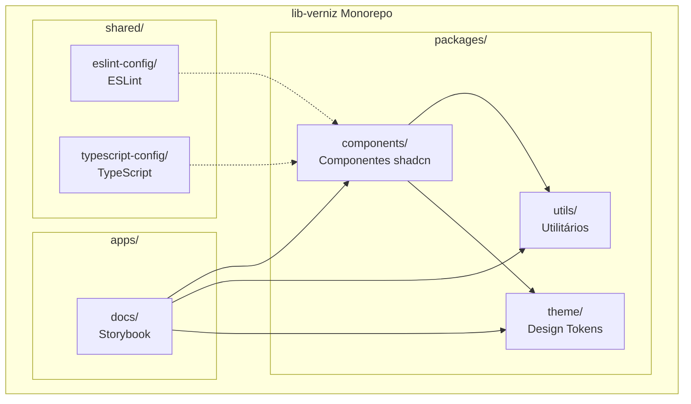

## 🔄 Fluxo de Desenvolvimento

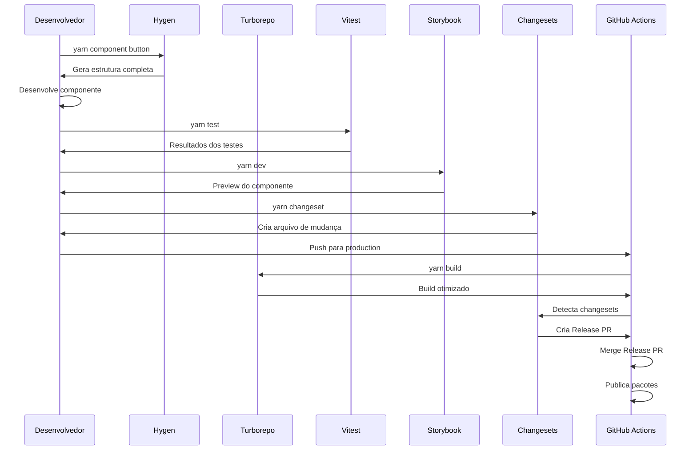

## 📦 Estrutura de Dependências

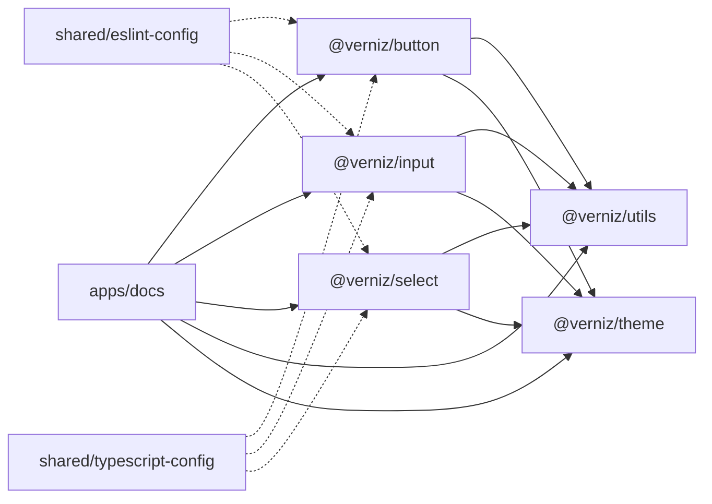

## 🔨 Fluxo de Build

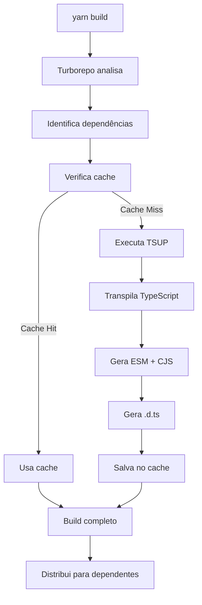

## 🧪 Fluxo de Testes

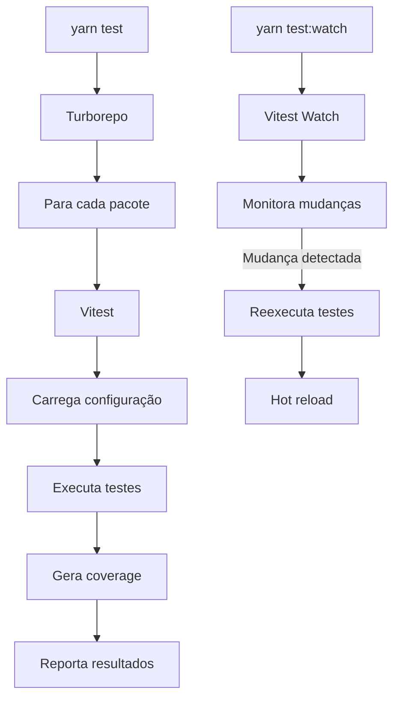

## 📚 Fluxo de Documentação

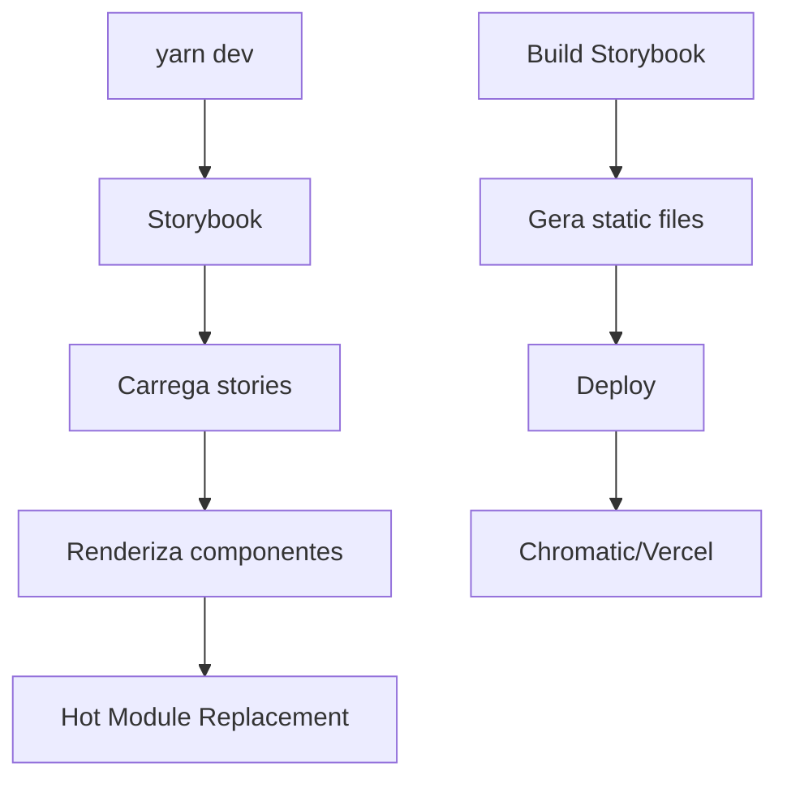

## 🚀 Fluxo de Release

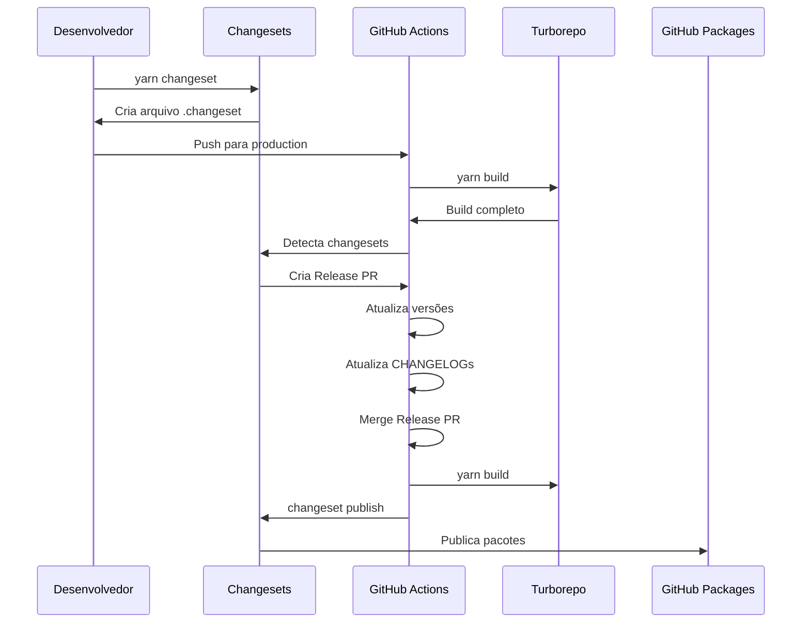

## 🏛️ Arquitetura de Componentes

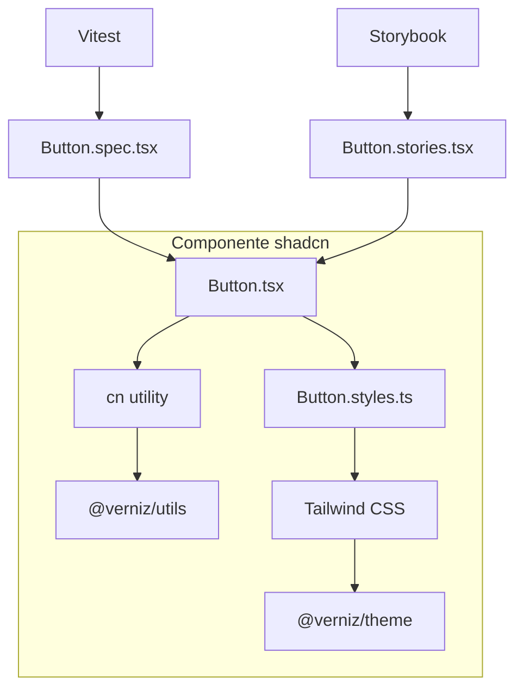

## 🔄 Ciclo de Vida do Componente

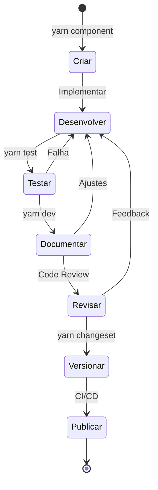

## 📊 Relações entre Ferramentas

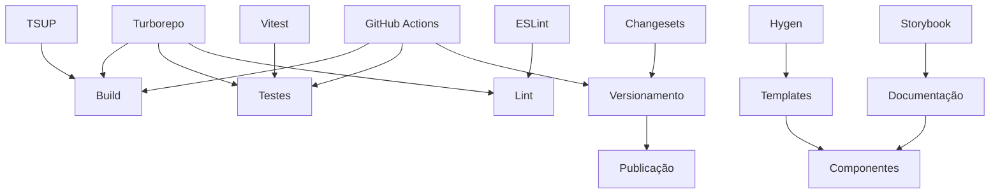

## 🎯 Stack Tecnológica Completa

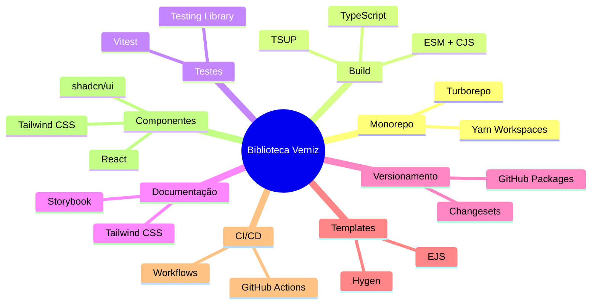

---

Estes diagramas fornecem uma visão clara da arquitetura e fluxos da biblioteca Verniz.

