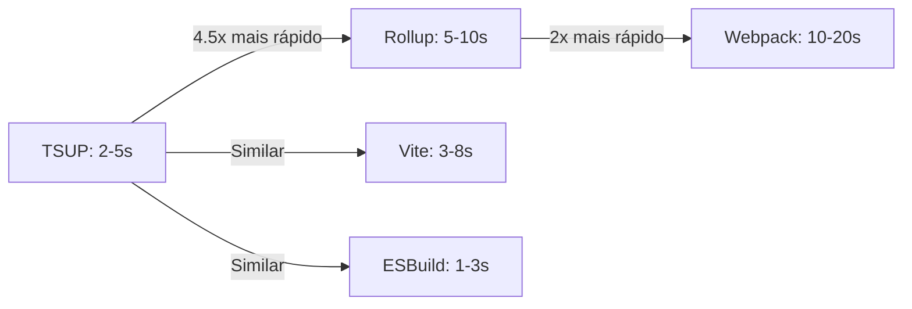

# Comparativo de Ferramentas de Build

## 📊 Tabela Comparativa Detalhada

| Aspecto | TSUP | Rollup | Webpack | Vite | ESBuild Direto |
|---------|------|--------|---------|------|----------------|
| **Velocidade** | ⭐⭐⭐⭐⭐ | ⭐⭐⭐ | ⭐⭐ | ⭐⭐⭐⭐ | ⭐⭐⭐⭐⭐ |
| **Simplicidade** | ⭐⭐⭐⭐⭐ | ⭐⭐⭐ | ⭐⭐ | ⭐⭐⭐⭐ | ⭐⭐⭐ |
| **TypeScript** | ⭐⭐⭐⭐⭐ | ⭐⭐⭐ | ⭐⭐⭐ | ⭐⭐⭐⭐ | ⭐⭐ |
| **.d.ts automático** | ✅ | ❌ | ❌ | ❌ | ❌ |
| **Tree-shaking** | ⭐⭐⭐⭐⭐ | ⭐⭐⭐⭐⭐ | ⭐⭐⭐ | ⭐⭐⭐⭐⭐ | ⭐⭐⭐⭐⭐ |
| **Plugins** | ⭐⭐ | ⭐⭐⭐⭐⭐ | ⭐⭐⭐⭐⭐ | ⭐⭐⭐⭐ | ⭐⭐ |
| **Flexibilidade** | ⭐⭐⭐ | ⭐⭐⭐⭐⭐ | ⭐⭐⭐⭐⭐ | ⭐⭐⭐⭐ | ⭐⭐⭐ |
| **Configuração** | ⭐⭐⭐⭐⭐ | ⭐⭐⭐ | ⭐⭐ | ⭐⭐⭐⭐ | ⭐⭐⭐ |
| **Bundle size** | ⭐⭐⭐⭐⭐ | ⭐⭐⭐⭐⭐ | ⭐⭐⭐ | ⭐⭐⭐⭐⭐ | ⭐⭐⭐⭐⭐ |
| **Dev Experience** | ⭐⭐⭐⭐ | ⭐⭐⭐ | ⭐⭐⭐ | ⭐⭐⭐⭐⭐ | ⭐⭐⭐ |
| **Manutenção** | ⭐⭐⭐⭐⭐ | ⭐⭐⭐ | ⭐⭐ | ⭐⭐⭐⭐ | ⭐⭐⭐ |
| **Curva aprendizado** | ⭐⭐⭐⭐⭐ | ⭐⭐⭐ | ⭐⭐ | ⭐⭐⭐⭐ | ⭐⭐⭐ |
| **Ecossistema** | ⭐⭐⭐ | ⭐⭐⭐⭐⭐ | ⭐⭐⭐⭐⭐ | ⭐⭐⭐⭐ | ⭐⭐ |
| **Custo manutenção** | ⭐⭐⭐⭐⭐ | ⭐⭐⭐ | ⭐⭐ | ⭐⭐⭐⭐ | ⭐⭐⭐ |

## ⚡ Performance Comparativa

### Tempo de Build (Projeto Médio - 30 componentes)

| Ferramenta | Primeira Execução | Incremental | Watch Mode |
|------------|------------------|-------------|------------|
| **TSUP** | 2-5s | 500ms-1s | 100-300ms |
| **Rollup** | 5-10s | 2-3s | 500ms-1s |
| **Webpack** | 10-20s | 3-5s | 1-2s |
| **Vite** | 3-8s | 1-2s | 200-500ms |
| **ESBuild** | 1-3s | 300-800ms | 100-200ms |

### Gráfico de Performance

## 💰 Custo de Manutenção

### Configuração Inicial

| Ferramenta | Tempo | Complexidade | Dependências |
|------------|-------|--------------|--------------|
| **TSUP** | 30min-1h | Baixa | Poucas |
| **Rollup** | 1-2h | Média | Múltiplas |
| **Webpack** | 2-4h | Alta | Muitas |
| **Vite** | 1-2h | Baixa/Média | Médias |
| **ESBuild** | 1-2h | Média | Poucas |

### Manutenção Mensal

| Ferramenta | Tempo | Complexidade | Frequência |
|------------|-------|--------------|------------|
| **TSUP** | 1-2h | Baixa | Baixa |
| **Rollup** | 2-4h | Média | Média |
| **Webpack** | 4-8h | Alta | Alta |
| **Vite** | 2-3h | Média | Média |
| **ESBuild** | 2-3h | Média | Baixa |

## 🎯 Casos de Uso

### Quando Usar TSUP

✅ Bibliotecas TypeScript  
✅ Projetos que precisam de builds rápidos  
✅ Monorepos  
✅ Componentes React/Vue  
✅ Precisa de .d.ts automático

### Quando Usar Rollup

✅ Precisa de plugins específicos  
✅ Transformações complexas  
✅ Projetos grandes com requisitos específicos  
✅ Tree-shaking crítico

### Quando Usar Webpack

✅ Aplicações complexas  
✅ Precisa de recursos específicos do Webpack  
✅ Projetos legados  
✅ Code splitting avançado necessário

### Quando Usar Vite

✅ Apps com bibliotecas internas  
✅ Precisa de dev server rápido  
✅ Projetos Vite existentes  
✅ HMR é crítico

### Quando Usar ESBuild Direto

✅ Performance crítica  
✅ Controle total necessário  
✅ Projetos simples  
✅ Aceita mais trabalho manual

## 📈 ROI Comparativo

### Tempo Economizado por Build

| Ferramenta | Economia vs Webpack | Economia vs Rollup |
|------------|-------------------|-------------------|
| **TSUP** | 8-15s | 3-5s |
| **Rollup** | 5-10s | - |
| **Vite** | 5-12s | 2-3s |
| **ESBuild** | 9-17s | 4-6s |

### Com 10 Builds por Dia

| Ferramenta | Tempo Economizado/Dia | Tempo Economizado/Mês |
|------------|---------------------|---------------------|
| **TSUP** | 1.3-2.5min | 26-50min |
| **Rollup** | 0.8-1.7min | 16-34min |
| **Vite** | 0.8-2min | 16-40min |
| **ESBuild** | 1.5-2.8min | 30-56min |

## 🔍 Análise Detalhada por Aspecto

### TypeScript Support

| Ferramenta | Nativo | Config Extra | .d.ts Auto |
|------------|--------|--------------|------------|
| **TSUP** | ✅ | ❌ | ✅ |
| **Rollup** | ❌ | ✅ (plugin) | ❌ |
| **Webpack** | ❌ | ✅ (loader) | ❌ |
| **Vite** | ✅ | ❌ | ❌ |
| **ESBuild** | ✅ | ❌ | ❌ |

### Múltiplos Formatos

| Ferramenta | ESM | CJS | UMD | Config |
|------------|-----|-----|-----|--------|
| **TSUP** | ✅ | ✅ | ✅ | Simples |
| **Rollup** | ✅ | ✅ | ✅ | Média |
| **Webpack** | ✅ | ✅ | ✅ | Complexa |
| **Vite** | ✅ | ✅ | ⚠️ | Média |
| **ESBuild** | ✅ | ✅ | ❌ | Manual |

### Ecossistema

| Ferramenta | Plugins | Comunidade | Documentação |
|------------|---------|------------|--------------|
| **TSUP** | ⭐⭐ | ⭐⭐⭐ | ⭐⭐⭐ |
| **Rollup** | ⭐⭐⭐⭐⭐ | ⭐⭐⭐⭐⭐ | ⭐⭐⭐⭐⭐ |
| **Webpack** | ⭐⭐⭐⭐⭐ | ⭐⭐⭐⭐⭐ | ⭐⭐⭐⭐⭐ |
| **Vite** | ⭐⭐⭐⭐ | ⭐⭐⭐⭐ | ⭐⭐⭐⭐ |
| **ESBuild** | ⭐⭐ | ⭐⭐⭐ | ⭐⭐⭐ |

## ✅ Recomendação Final

### Para Biblioteca Verniz

**Escolha: TSUP**

**Justificativas:**
1. ✅ Performance excepcional (4.5x mais rápido que Rollup)
2. ✅ Simplicidade máxima (zero config)
3. ✅ TypeScript nativo (sem plugins)
4. ✅ .d.ts automático (sem configuração)
5. ✅ Perfeito para bibliotecas
6. ✅ Manutenção simples

**Alternativas consideradas:**
- Rollup: Se precisar de plugins específicos
- Vite: Se for parte de projeto Vite maior
- Webpack: Não recomendado para libs simples
- ESBuild: Se performance for crítica e aceitar mais trabalho

---

**Conclusão**: TSUP oferece o melhor equilíbrio entre simplicidade, performance e funcionalidades para bibliotecas TypeScript modernas como a Verniz.

