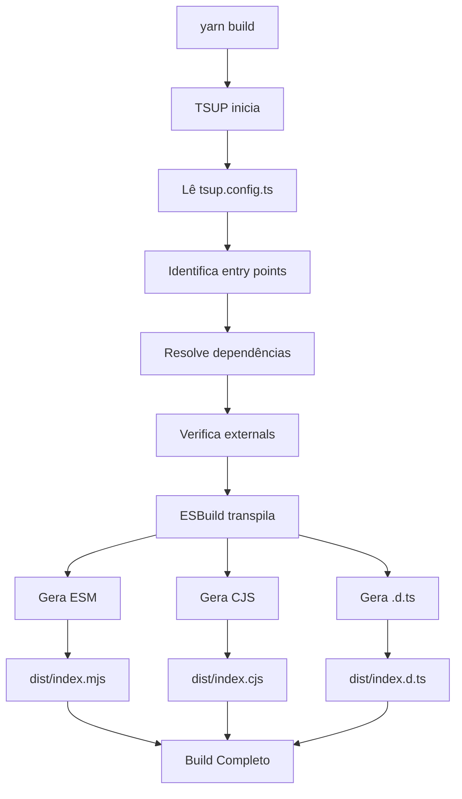
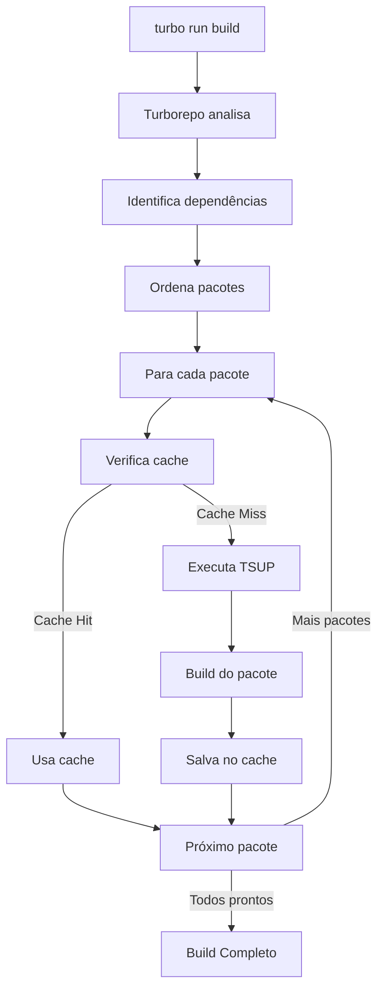
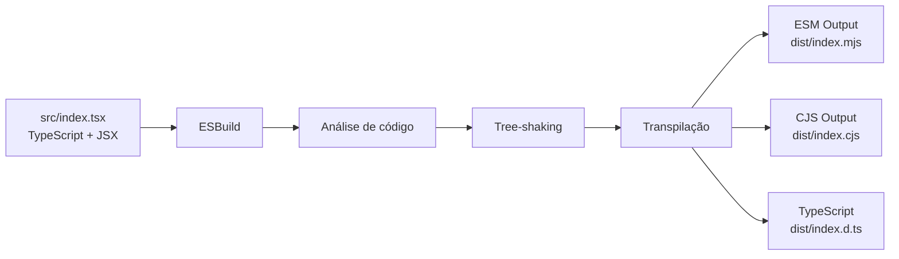
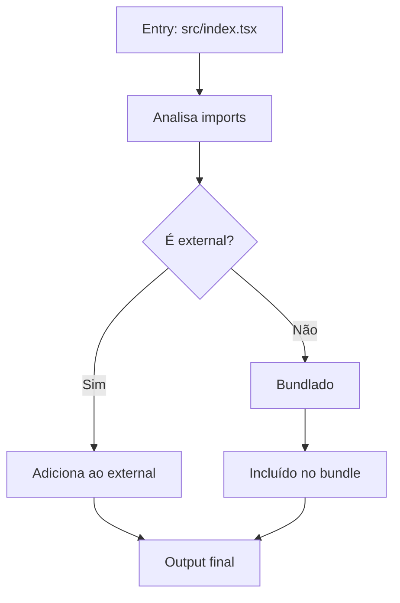
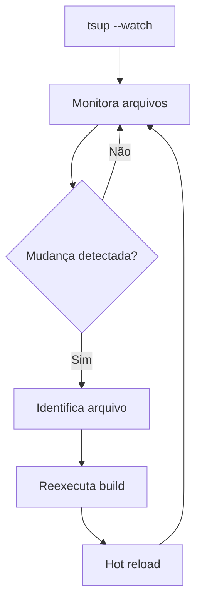
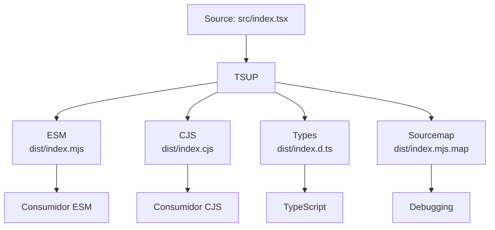
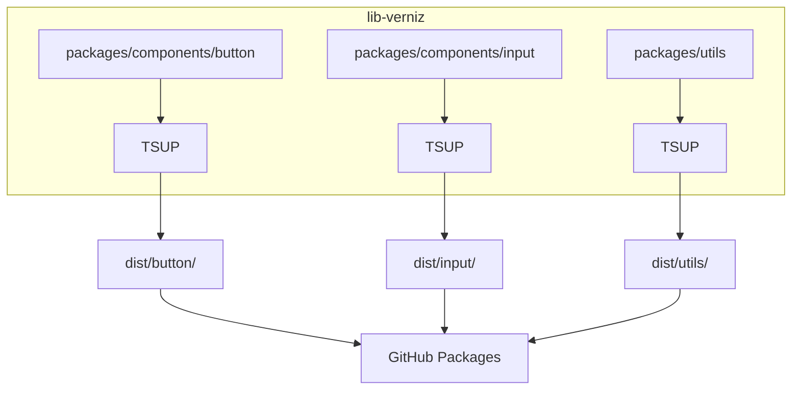
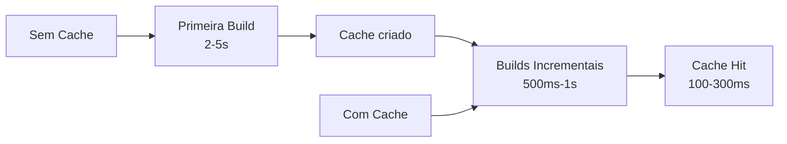
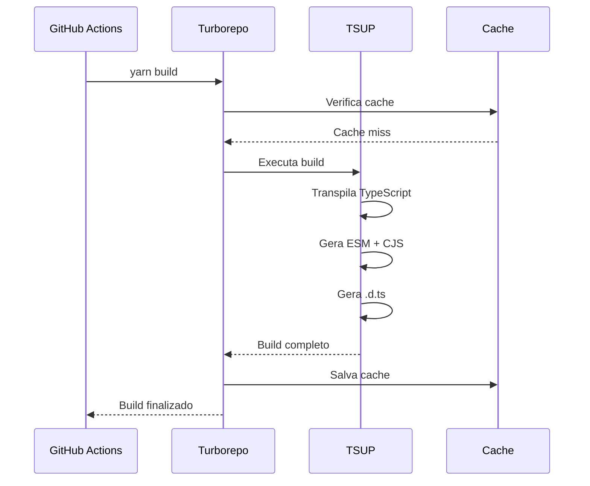
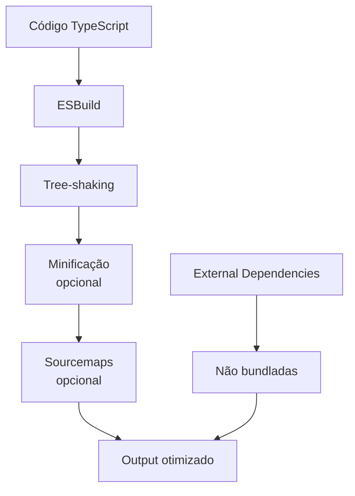

# Diagramas de Build - TSUP

## 🔨 Fluxo de Build Básico

## 🔄 Fluxo de Build com Turborepo

## 📦 Processo de Transpilação

## 🎯 Resolução de Dependências

## 🔍 Fluxo de Watch Mode

## 📊 Comparativo de Output

## 🏗️ Arquitetura de Build

## ⚡ Performance do Build

## 🔄 Integração com CI/CD

## 📈 Fluxo de Otimização

---

Estes diagramas ilustram o fluxo completo de build com TSUP, desde a entrada do código até a geração dos artefatos finais.

