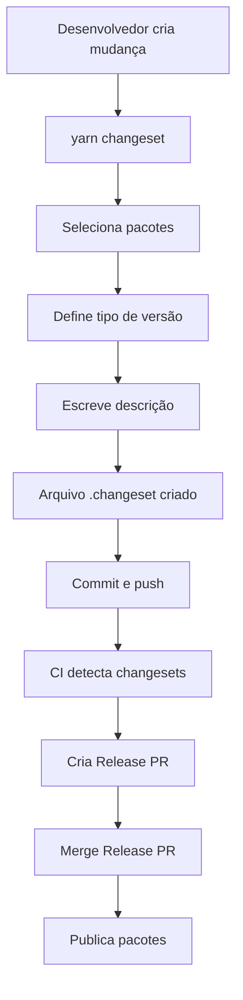

# Changesets - Análise Completa

## 📋 O que é Changesets?

**Changesets** é uma ferramenta para gerenciar versionamento e changelogs em monorepos. Coordena versões de múltiplos pacotes e automatiza a publicação.

## 🎯 Características Principais

- ✅ **Versionamento semântico**: Major, Minor, Patch
- ✅ **CHANGELOG automático**: Geração automática
- ✅ **Coordenação de dependências**: Atualiza dependências internas
- ✅ **Suporte a múltiplos registries**: npm, GitHub Packages, etc.
- ✅ **PRs automáticos**: Cria PRs de release automaticamente
- ✅ **Integração CI/CD**: Perfeita integração com GitHub Actions

## 🔄 Como Funciona

### Fluxo Básico



### Estrutura de Arquivo Changeset

```markdown
---
"@verniz/button": patch
"@verniz/utils": patch
---

Adiciona suporte a ícones no componente Button
```

## ✅ Prós

### 1. Simplicidade Extrema

```bash
# Criar changeset
yarn changeset

# Seleciona pacotes e tipo de versão
# Escreve descrição
# Pronto!
```

**Workflow claro e simples.**

### 2. Versionamento Inteligente

- Atualiza dependências internas automaticamente
- Versões coordenadas entre pacotes
- Semântico automático
- Evita versões inconsistentes

### 3. CHANGELOG Automático

- Geração automática de CHANGELOGs
- Formato consistente
- Histórico claro de mudanças
- Atualização automática

### 4. CI/CD Integrado

- PRs automáticos de release
- Publicação automática
- Integração perfeita com GitHub Actions
- Processo totalmente automatizado

### 5. Flexibilidade

- Suporta múltiplos registries
- Versões fixas/vinculadas
- Customização de changelog
- Configuração flexível

### 6. Manutenção

- Menos trabalho manual
- Menos erros humanos
- Processo padronizado
- Fácil de entender

## ❌ Contras

### 1. Apenas Monorepos

- Não funciona bem em polyrepos
- Requer estrutura de monorepo
- Dependência de workspaces

### 2. Curva de Aprendizado

- Conceitos novos para alguns
- Workflow específico
- Requer treinamento inicial

### 3. Dependência de CI/CD

- Melhor com automação
- Setup inicial necessário
- Requer configuração de workflows

### 4. Versionamento Automático

- Pode versionar pacotes não alterados
- Requer atenção ao criar changesets
- Pode gerar mais versões que o necessário

### 5. Ecossistema Menor

- Menos plugins que Lerna
- Comunidade menor
- Documentação limitada (mas suficiente)

## 📊 Comparativo Detalhado

### Changesets vs Lerna

| Aspecto | Changesets | Lerna |
|---------|-----------|-------|
| **Simplicidade** | ⭐⭐⭐⭐⭐ | ⭐⭐⭐ |
| **Velocidade** | ⭐⭐⭐⭐ | ⭐⭐⭐ |
| **Configuração** | ⭐⭐⭐⭐⭐ | ⭐⭐⭐ |
| **CI/CD** | ⭐⭐⭐⭐⭐ | ⭐⭐⭐ |
| **CHANGELOG** | ⭐⭐⭐⭐⭐ | ⭐⭐⭐ |
| **Ecossistema** | ⭐⭐⭐ | ⭐⭐⭐⭐⭐ |

### Changesets vs Manual

| Aspecto | Changesets | Manual |
|---------|-----------|--------|
| **Tempo** | ⭐⭐⭐⭐⭐ | ⭐⭐ |
| **Erros** | ⭐⭐⭐⭐⭐ | ⭐ |
| **Consistência** | ⭐⭐⭐⭐⭐ | ⭐⭐ |
| **Automação** | ⭐⭐⭐⭐⭐ | ⭐ |

## 🎯 Casos de Uso

### Ideal para Changesets

✅ **Monorepos**  
✅ **Múltiplos pacotes relacionados**  
✅ **Versionamento coordenado**  
✅ **CI/CD automatizado**  
✅ **Times que querem simplicidade**

### Evitar Changesets quando

❌ Polyrepos  
❌ Versionamento completamente independente  
❌ Projetos muito pequenos (1-2 pacotes)  
❌ Sem automação de CI/CD

## 📈 Performance

### Tempo de Operação

- **Criar changeset**: 10-30s
- **Gerar versões**: 5-10s (10-20 pacotes)
- **Publicar**: 2-5min (depende do registry)

### Comparativo

| Operação | Changesets | Manual |
|----------|-----------|--------|
| **Criar mudança** | 10-30s | 5-10min |
| **Versionar** | 5-10s | 30-60min |
| **Publicar** | 2-5min | 10-20min |
| **Total** | **15-20min** | **45-90min** |

## 💰 Impacto na Manutenção

### Configuração Inicial

- **Tempo**: 1-2h
- **Complexidade**: Baixa/Média
- **Dependências**: Poucas

### Manutenção Contínua

- **Atualizações**: Simples
- **Debugging**: Fácil
- **Processo**: Padronizado
- **Custo**: Baixo

### ROI

- **Tempo economizado**: 30-70min por release
- **Com 4 releases/mês**: 2-4.5h/mês
- **Redução de erros**: 80-90%

## ✅ Recomendação

**Changesets é a escolha recomendada** para a biblioteca Verniz porque:

1. ✅ Simplicidade máxima
2. ✅ Versionamento inteligente
3. ✅ CHANGELOG automático
4. ✅ Integração perfeita com CI/CD
5. ✅ Manutenção simples
6. ✅ Processo padronizado

---

**Conclusão**: Changesets oferece a melhor experiência para versionamento em monorepos, com automação completa e simplicidade.

