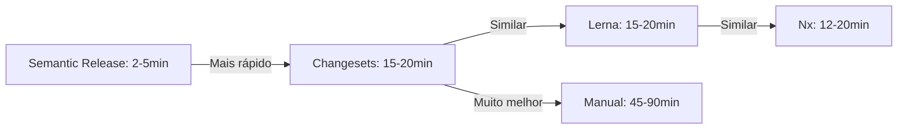

# Comparativo de Ferramentas de Versionamento

## 📊 Tabela Comparativa Detalhada

| Aspecto | Changesets | Lerna | Nx | Rush | Manual | Semantic Release |
|---------|-----------|-------|-----|------|--------|------------------|
| **Simplicidade** | ⭐⭐⭐⭐⭐ | ⭐⭐⭐ | ⭐⭐ | ⭐⭐ | ⭐⭐⭐⭐⭐ | ⭐⭐⭐ |
| **Velocidade** | ⭐⭐⭐⭐ | ⭐⭐⭐ | ⭐⭐⭐⭐ | ⭐⭐⭐ | ⭐⭐⭐⭐⭐ | ⭐⭐⭐⭐ |
| **Monorepo** | ⭐⭐⭐⭐⭐ | ⭐⭐⭐⭐⭐ | ⭐⭐⭐⭐⭐ | ⭐⭐⭐⭐⭐ | ⭐⭐ | ⭐⭐⭐ |
| **Coordenação** | ⭐⭐⭐⭐⭐ | ⭐⭐⭐⭐ | ⭐⭐⭐⭐⭐ | ⭐⭐⭐⭐⭐ | ⭐ | ⭐⭐⭐ |
| **CHANGELOG** | ⭐⭐⭐⭐⭐ | ⭐⭐⭐ | ⭐⭐⭐⭐ | ⭐⭐⭐ | ⭐ | ⭐⭐⭐⭐⭐ |
| **CI/CD** | ⭐⭐⭐⭐⭐ | ⭐⭐⭐ | ⭐⭐⭐⭐⭐ | ⭐⭐⭐⭐ | ⭐ | ⭐⭐⭐⭐⭐ |
| **Flexibilidade** | ⭐⭐⭐⭐ | ⭐⭐⭐⭐⭐ | ⭐⭐⭐⭐ | ⭐⭐⭐ | ⭐⭐⭐⭐⭐ | ⭐⭐⭐ |
| **Configuração** | ⭐⭐⭐⭐⭐ | ⭐⭐⭐ | ⭐⭐ | ⭐⭐ | ⭐⭐⭐⭐⭐ | ⭐⭐⭐ |
| **Manutenção** | ⭐⭐⭐⭐⭐ | ⭐⭐⭐ | ⭐⭐⭐ | ⭐⭐ | ⭐⭐ | ⭐⭐⭐⭐ |
| **Curva aprendizado** | ⭐⭐⭐⭐ | ⭐⭐⭐ | ⭐⭐ | ⭐⭐ | ⭐⭐⭐⭐⭐ | ⭐⭐⭐ |
| **Custo manutenção** | ⭐⭐⭐⭐⭐ | ⭐⭐⭐ | ⭐⭐⭐ | ⭐⭐ | ⭐ | ⭐⭐⭐⭐ |
| **Ecossistema** | ⭐⭐⭐ | ⭐⭐⭐⭐⭐ | ⭐⭐⭐⭐ | ⭐⭐⭐ | N/A | ⭐⭐⭐⭐ |

## ⚡ Performance Comparativa

### Tempo de Operação

| Ferramenta | Criar Mudança | Versionar | Publicar | Total |
|------------|--------------|-----------|----------|-------|
| **Changesets** | 10-30s | 5-10s | 2-5min | 15-20min |
| **Lerna** | 5-10min | 10-30s | 3-10min | 15-20min |
| **Nx** | 5-10min | 5-15s | 2-5min | 12-20min |
| **Manual** | 5-10min | 30-60min | 10-20min | 45-90min |
| **Semantic Release** | 0s (automático) | 0s (automático) | 2-5min | 2-5min |

### Gráfico de Performance

## 💰 Custo de Manutenção

### Configuração Inicial

| Ferramenta | Tempo | Complexidade | Dependências |
|------------|-------|--------------|--------------|
| **Changesets** | 1-2h | Baixa/Média | Poucas |
| **Lerna** | 2-4h | Média/Alta | Múltiplas |
| **Nx** | 4-8h | Alta | Muitas |
| **Rush** | 8-16h | Muito Alta | Muitas |
| **Manual** | 0h | N/A | Nenhuma |
| **Semantic Release** | 2-4h | Média | Múltiplas |

### Manutenção Mensal

| Ferramenta | Tempo | Complexidade | Frequência |
|------------|-------|--------------|------------|
| **Changesets** | 30min-1h | Baixa | Baixa |
| **Lerna** | 1-2h | Média | Média |
| **Nx** | 1-2h | Média | Média |
| **Rush** | 2-4h | Alta | Alta |
| **Manual** | 4-8h | Alta | Alta |
| **Semantic Release** | 30min-1h | Baixa | Baixa |

## 🎯 Casos de Uso

### Quando Usar Changesets

✅ Monorepos  
✅ Múltiplos pacotes relacionados  
✅ Versionamento coordenado  
✅ CI/CD automatizado  
✅ Times que querem simplicidade

### Quando Usar Lerna

✅ Monorepos grandes  
✅ Precisa de recursos avançados  
✅ Projetos legados  
✅ Ecossistema específico necessário

### Quando Usar Nx

✅ Monorepos muito grandes  
✅ Precisa de ferramentas completas  
✅ Projetos enterprise  
✅ Cache e análise importantes

### Quando Usar Manual

✅ Projetos muito pequenos  
✅ Polyrepos  
✅ Necessidades muito específicas  
✅ Controle total necessário

### Quando Usar Semantic Release

✅ Time muito disciplinado com commits  
✅ Automação total desejada  
✅ Projetos com conventional commits  
✅ Menos intervenção manual

## 📈 ROI Comparativo

### Tempo Economizado por Release

| Ferramenta | Economia vs Manual | Economia vs Lerna |
|------------|-------------------|------------------|
| **Changesets** | 30-70min | 0-5min |
| **Lerna** | 25-65min | - |
| **Nx** | 30-70min | 0-5min |
| **Semantic Release** | 40-85min | 10-15min |

### Com 4 Releases por Mês

| Ferramenta | Tempo Economizado/Mês | Redução de Erros |
|------------|---------------------|------------------|
| **Changesets** | 2-4.5h | 80-90% |
| **Lerna** | 1.5-4h | 70-80% |
| **Nx** | 2-4.5h | 80-90% |
| **Semantic Release** | 2.5-5.5h | 85-95% |
| **Manual** | - | - |

## 🔍 Análise Detalhada por Aspecto

### Coordenação de Versões

| Ferramenta | Automática | Dependências Internas | CHANGELOG |
|------------|-----------|----------------------|-----------|
| **Changesets** | ✅ | ✅ | ✅ |
| **Lerna** | ✅ | ✅ | ⚠️ |
| **Nx** | ✅ | ✅ | ✅ |
| **Rush** | ✅ | ✅ | ⚠️ |
| **Manual** | ❌ | ❌ | ❌ |
| **Semantic Release** | ✅ | ⚠️ | ✅ |

### Integração CI/CD

| Ferramenta | PRs Automáticos | Publicação Automática | GitHub Actions |
|------------|----------------|---------------------|----------------|
| **Changesets** | ✅ | ✅ | ✅ |
| **Lerna** | ⚠️ | ✅ | ⚠️ |
| **Nx** | ✅ | ✅ | ✅ |
| **Rush** | ⚠️ | ✅ | ⚠️ |
| **Manual** | ❌ | ❌ | ⚠️ |
| **Semantic Release** | ❌ | ✅ | ✅ |

### Flexibilidade

| Ferramenta | Customização | Versões Fixas | Versões Vinculadas |
|------------|-------------|---------------|-------------------|
| **Changesets** | ⭐⭐⭐⭐ | ✅ | ✅ |
| **Lerna** | ⭐⭐⭐⭐⭐ | ✅ | ✅ |
| **Nx** | ⭐⭐⭐⭐ | ✅ | ✅ |
| **Rush** | ⭐⭐⭐ | ✅ | ✅ |
| **Manual** | ⭐⭐⭐⭐⭐ | ✅ | ✅ |
| **Semantic Release** | ⭐⭐⭐ | ❌ | ❌ |

## ✅ Recomendação Final

### Para Biblioteca Verniz

**Escolha: Changesets**

**Justificativas:**
1. ✅ Simplicidade máxima
2. ✅ Versionamento inteligente
3. ✅ CHANGELOG automático
4. ✅ Integração perfeita com CI/CD
5. ✅ Manutenção simples
6. ✅ Processo padronizado

**Alternativas consideradas:**
- Lerna: Se precisar de recursos avançados
- Nx: Se já usar Nx ou precisar de ferramentas completas
- Semantic Release: Se time seguir conventional commits rigorosamente
- Manual: Evitar em monorepos

---

**Conclusão**: Changesets oferece a melhor experiência para versionamento em monorepos, com automação completa, simplicidade e manutenção facilitada.

