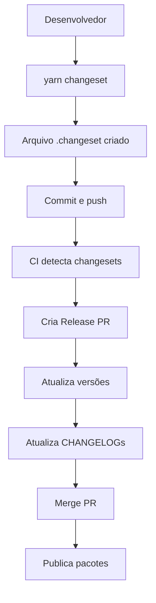

# Configuração Changesets - Guia Completo

## 📋 Setup Inicial

### Instalação

```bash
# Instalar Changesets
yarn add -D @changesets/cli
```

### Inicialização

```bash
# Criar configuração inicial
yarn changeset init
```

Isso cria o arquivo `.changeset/config.json`.

## ⚙️ Configuração Recomendada

### `.changeset/config.json`

```json
{
  "$schema": "https://unpkg.com/@changesets/config@2.0.0/schema.json",
  "changelog": "@changesets/cli/changelog",
  "commit": false,
  "fixed": [],
  "linked": [],
  "access": "public",
  "baseBranch": "main",
  "updateInternalDependencies": "patch",
  "ignore": ["@verniz/docs"]
}
```

### Explicação das Opções

- **`changelog`**: Como gerar CHANGELOGs
- **`commit`**: Se deve commitar automaticamente (false = manual)
- **`fixed`**: Pacotes com versão fixa (mesma versão sempre)
- **`linked`**: Pacotes com versão vinculada
- **`access`**: Acesso npm (public/restricted)
- **`baseBranch`**: Branch base para PRs
- **`updateInternalDependencies`**: Como atualizar deps internas (patch/minor/major)
- **`ignore`**: Pacotes a ignorar no versionamento

## 🔄 Workflow Básico

### 1. Criar Changeset

```bash
yarn changeset
```

**Processo interativo:**
1. Seleciona pacotes afetados
2. Define tipo de versão (major/minor/patch)
3. Escreve descrição da mudança

**Resultado:** Arquivo `.changeset/[hash]-[description].md`

### 2. Estrutura do Arquivo Changeset

```markdown
---
"@verniz/button": patch
"@verniz/utils": patch
---

Adiciona suporte a ícones no componente Button
```

### 3. Commit e Push

```bash
git add .changeset/
git commit -m "chore: add changeset"
git push
```

### 4. CI/CD Detecta e Cria Release PR

O GitHub Actions detecta changesets e cria PR automaticamente.

### 5. Merge Release PR

Após merge, os pacotes são publicados automaticamente.

## 📝 Scripts no package.json

### Scripts Essenciais

```json
{
  "scripts": {
    "changeset": "changeset",
    "version-packages": "changeset version",
    "publish-packages": "turbo run build && changeset version && changeset publish"
  }
}
```

### Explicação

- **`changeset`**: Cria novo changeset
- **`version-packages`**: Atualiza versões e CHANGELOGs
- **`publish-packages`**: Build + version + publish

## 🎯 Configurações Avançadas

### Versões Fixas

Para pacotes que sempre devem ter a mesma versão:

```json
{
  "fixed": [
    ["@verniz/button", "@verniz/input"]
  ]
}
```

### Versões Vinculadas

Para pacotes que devem ter versões relacionadas:

```json
{
  "linked": [
    ["@verniz/utils", "@verniz/theme"]
  ]
}
```

### Changelog Customizado

```json
{
  "changelog": [
    "@changesets/changelog-github",
    {
      "repo": "madeiramadeirabr/lib-verniz"
    }
  ]
}
```

## 🔧 Integração com CI/CD

### GitHub Actions Workflow

```yaml
name: Release

on:
  push:
    branches: [main]

jobs:
  release:
    runs-on: ubuntu-latest
    steps:
      - uses: actions/checkout@v4
      - uses: actions/setup-node@v4
        with:
          node-version: 18
      
      - run: yarn install
      - run: yarn build
      
      - uses: changesets/action@v1
        with:
          publish: yarn publish-packages
        env:
          GITHUB_TOKEN: ${{ secrets.GITHUB_TOKEN }}
          NODE_AUTH_TOKEN: ${{ secrets.GITHUB_TOKEN }}
```

## 📊 Estrutura de Arquivos

### Após Criar Changeset

```
.changeset/
├── config.json
└── [hash]-[description].md
```

### Após Versionar

```
packages/
├── button/
│   ├── CHANGELOG.md  # Atualizado
│   └── package.json  # Versão atualizada
└── utils/
    ├── CHANGELOG.md
    └── package.json
```

## 🎨 Exemplos Práticos

### Exemplo 1: Patch Release

```bash
# Mudança pequena (bug fix)
yarn changeset
# Seleciona: @verniz/button
# Tipo: patch
# Descrição: Fix button disabled state
```

### Exemplo 2: Minor Release

```bash
# Nova feature (backward compatible)
yarn changeset
# Seleciona: @verniz/button, @verniz/input
# Tipo: minor
# Descrição: Add icon support to buttons
```

### Exemplo 3: Major Release

```bash
# Breaking change
yarn changeset
# Seleciona: @verniz/button
# Tipo: major
# Descrição: Remove deprecated props
```

## ⚠️ Boas Práticas

### 1. Criar Changeset para Cada Mudança

```bash
# Sempre criar changeset ao fazer mudanças
yarn changeset
```

### 2. Descrições Claras

```markdown
---
"@verniz/button": patch
---

Fix button disabled state not working correctly
```

### 3. Agrupar Mudanças Relacionadas

```markdown
---
"@verniz/button": minor
"@verniz/input": minor
---

Add icon support to form components
```

### 4. Não Commitar Changesets Vazios

```bash
# Remover changesets não usados
rm .changeset/[hash]-*.md
```

### 5. Revisar Release PRs

Sempre revisar o PR de release antes de merge.

## 🐛 Troubleshooting

### Problema: Changesets não detectados

**Solução:**
```bash
# Verificar se arquivos existem
ls .changeset/

# Verificar configuração
cat .changeset/config.json
```

### Problema: Versões não atualizadas

**Solução:**
```bash
# Executar version manualmente
yarn changeset version
```

### Problema: Dependências internas não atualizadas

**Solução:**
```json
{
  "updateInternalDependencies": "patch" // ou "minor"
}
```

## 📈 Fluxo Completo



## ✅ Checklist de Configuração

- [ ] Changesets instalado
- [ ] `.changeset/config.json` criado
- [ ] Scripts no `package.json`
- [ ] CI/CD configurado
- [ ] Testado localmente
- [ ] Documentado para o time

---

Esta configuração garante versionamento coordenado, CHANGELOGs automáticos e publicação simplificada.

