# Fluxo de Versionamento - Changesets

## 🔄 Fluxo Completo

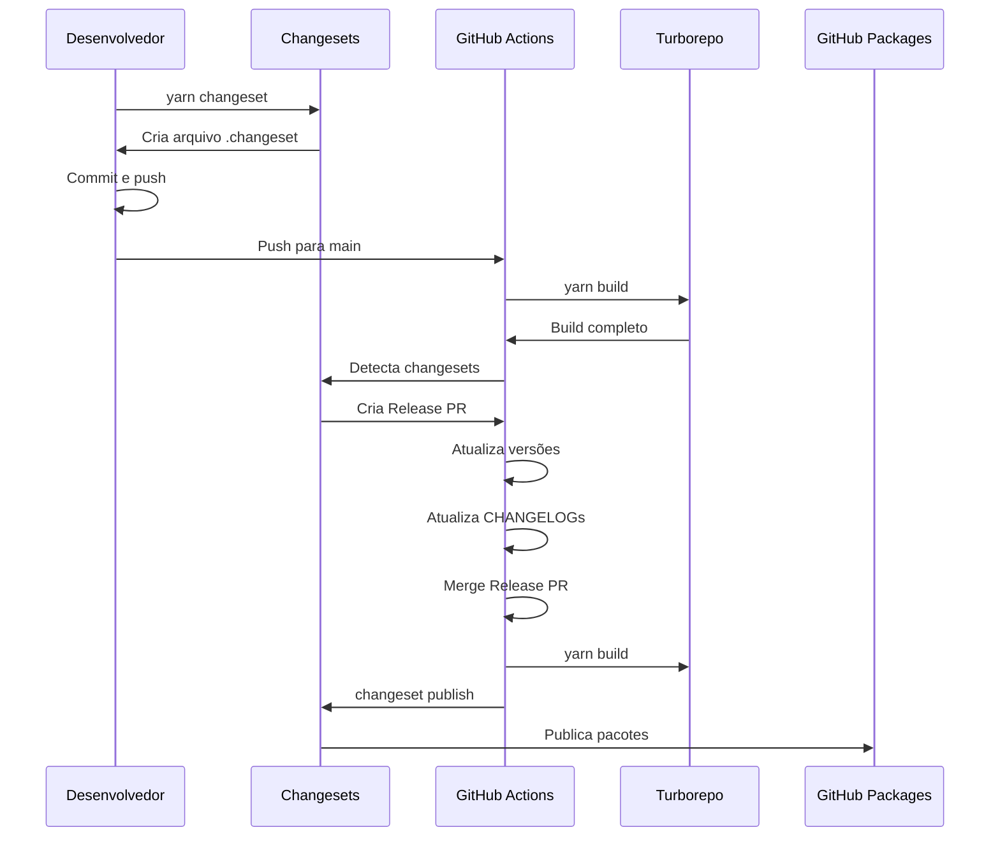

## 📊 Estados do Versionamento

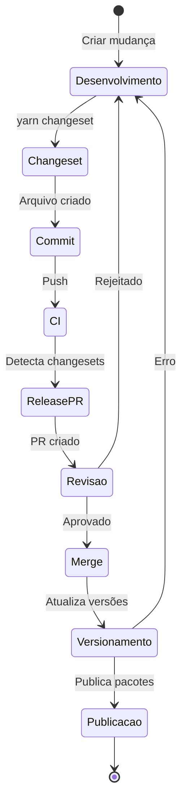

## 🎯 Fluxo Detalhado por Etapa

### Etapa 1: Desenvolvimento

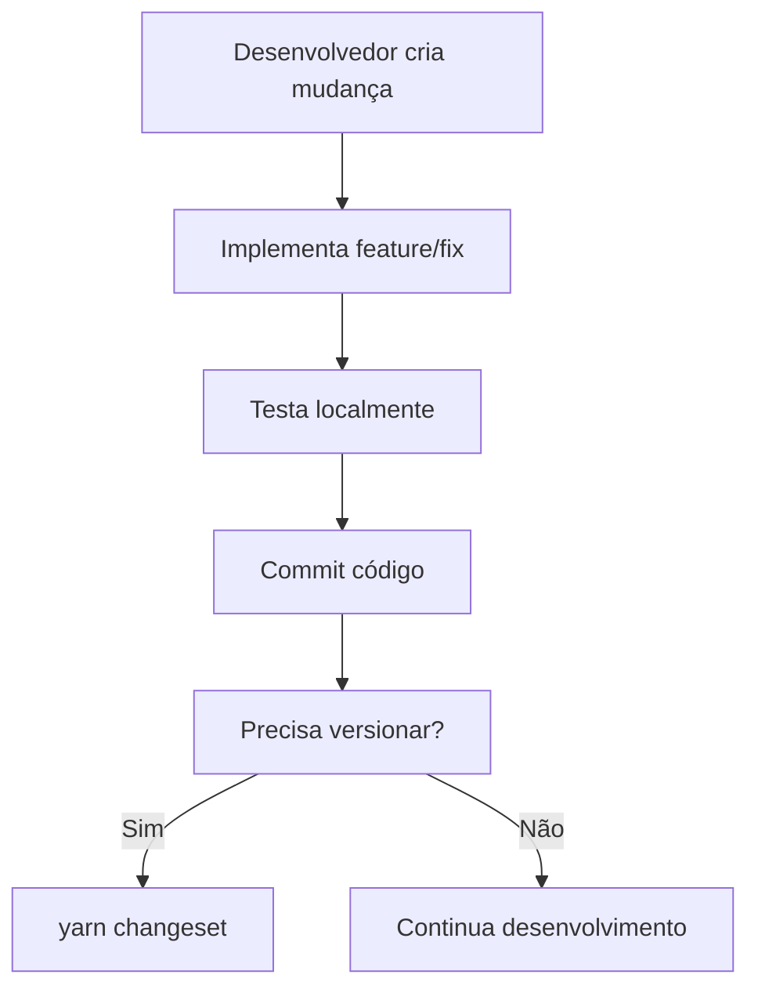

### Etapa 2: Criar Changeset

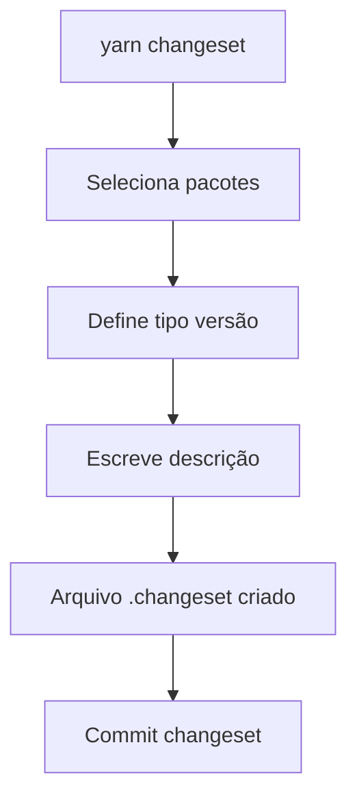

### Etapa 3: CI/CD Detecta

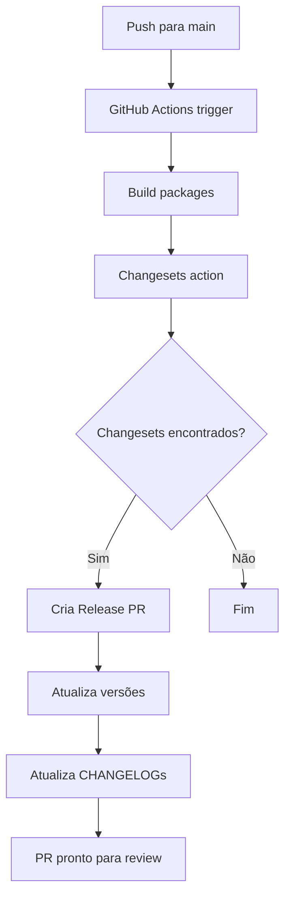

### Etapa 4: Release PR

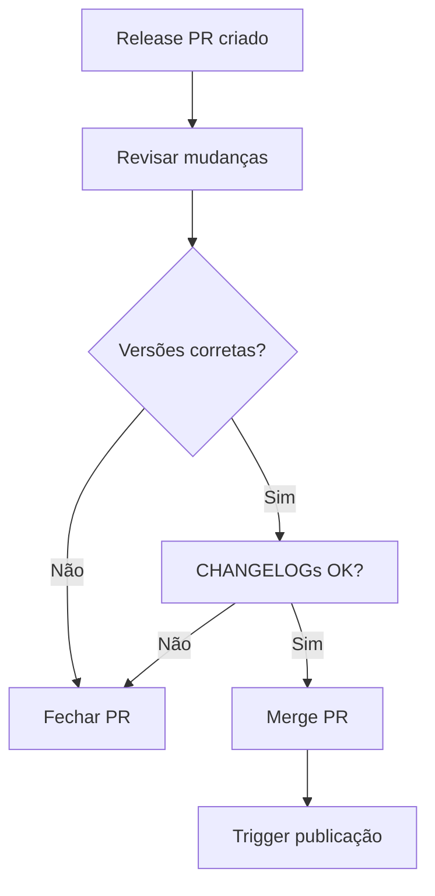

### Etapa 5: Publicação

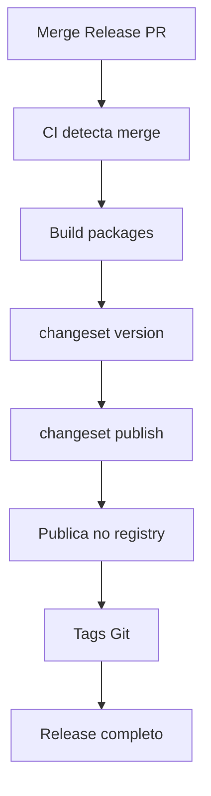

## 📦 Estrutura de Arquivos Durante o Fluxo

### Estado Inicial

```
.changeset/
├── config.json
└── (vazio)
```

### Após Criar Changeset

```
.changeset/
├── config.json
└── abc123-add-icon-support.md
```

### Após Versionar

```
packages/
├── button/
│   ├── CHANGELOG.md  # Atualizado
│   └── package.json  # Versão: 0.0.1 → 0.0.2
└── utils/
    ├── CHANGELOG.md
    └── package.json
```

## 🔄 Ciclo de Vida de um Changeset

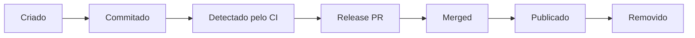

## 🎯 Tipos de Versão

### Patch (0.0.1 → 0.0.2)

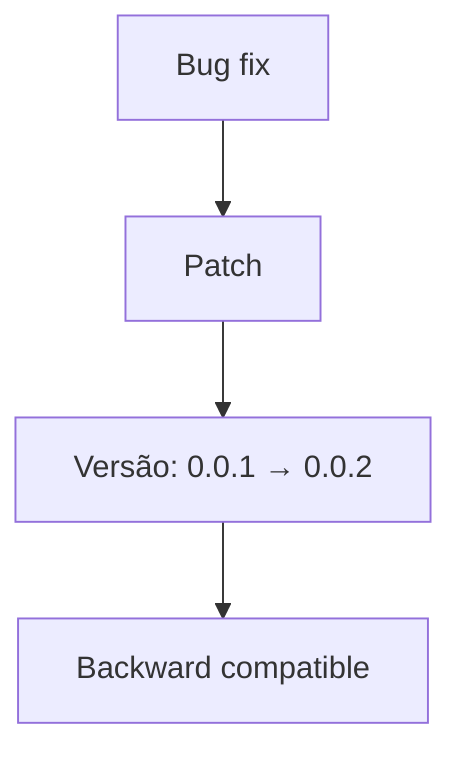

### Minor (0.0.1 → 0.1.0)

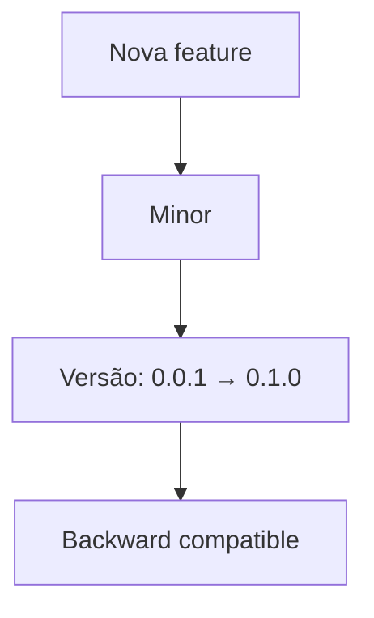

### Major (0.0.1 → 1.0.0)

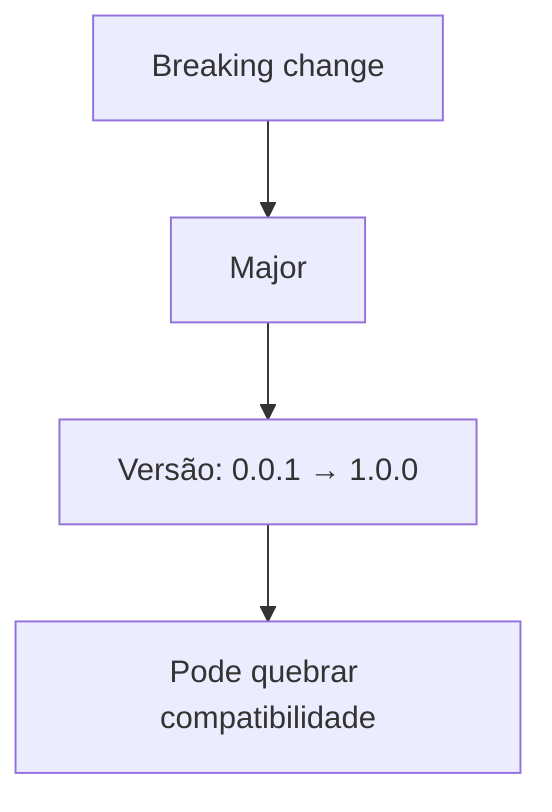

## 📊 Coordenação de Dependências

```mermaid
graph TD
    A[@verniz/button: patch] --> B[Atualiza versão]
    B --> C[@verniz/utils: patch]
    C --> D[Dependência interna atualizada]
    D --> E[Versões coordenadas]
```

## ⚡ Performance do Fluxo

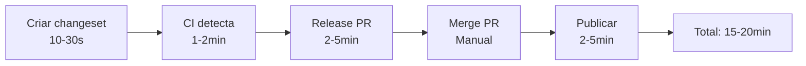

---

Estes diagramas ilustram o fluxo completo de versionamento com Changesets, desde a criação do changeset até a publicação dos pacotes.

