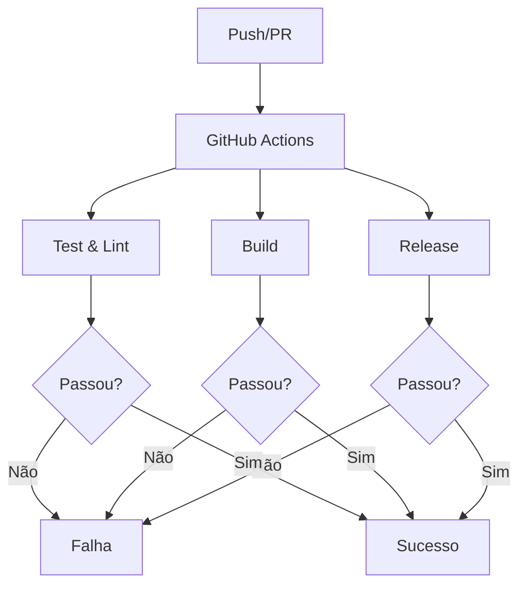

# GitHub Actions - Visão Geral

## 📋 O que é GitHub Actions?

**GitHub Actions** é uma plataforma de CI/CD integrada ao GitHub, permitindo automação de workflows diretamente no repositório.

## 🎯 Características

- ✅ **Integração nativa**: Com GitHub
- ✅ **Workflows YAML**: Configuração simples
- ✅ **Marketplace**: Ações prontas
- ✅ **Matriz builds**: Múltiplos ambientes
- ✅ **Caching**: Cache inteligente
- ✅ **Secrets**: Gerenciamento seguro

## 🔄 Workflows Principais

1. **Test & Lint**: Validação de código
2. **Build**: Compilação de pacotes
3. **Release**: Versionamento e publicação

## 📊 Fluxo Completo

## ✅ Benefícios

- ✅ Automação completa
- ✅ Integração nativa
- ✅ Fácil configuração
- ✅ Marketplace rico
- ✅ Custo eficiente

---

GitHub Actions oferece automação completa e integrada para CI/CD.

