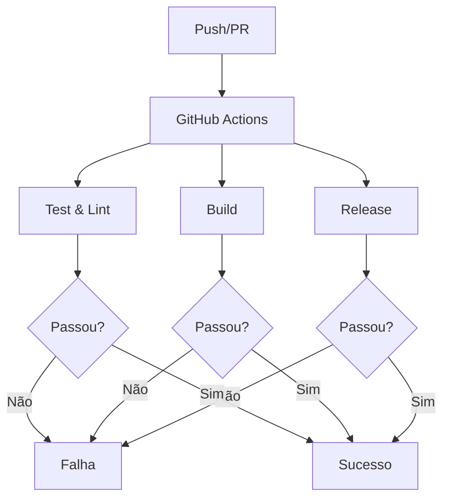
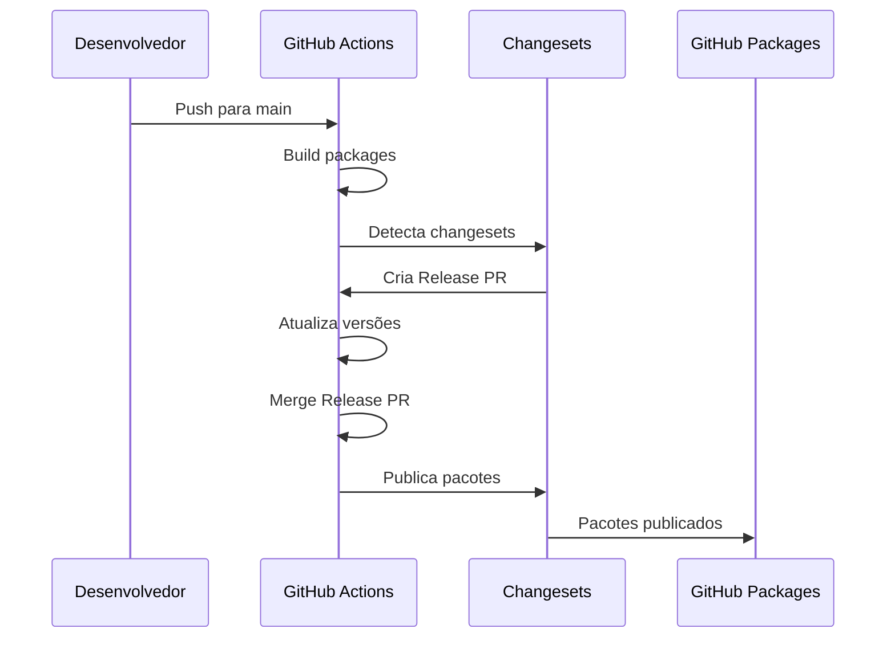

# Diagramas CI/CD - GitHub Actions

## 🔄 Fluxo Completo

```mermaid
graph TD
    A[Push/PR] --> B[GitHub Actions]
    B --> C[Test & Lint]
    B --> D[Build]
    B --> E[Release]
    C --> F{Passou?}
    D --> G{Passou?}
    E --> H{Passou?}
    F -->|Não| I[Falha]
    G -->|Não| I
    H -->|Não| I
    F -->|Sim| J[Sucesso]
    G -->|Sim| J
    H -->|Sim| J
```

## 📊 Workflow de Release

```mermaid
sequenceDiagram
    participant Dev as Desenvolvedor
    participant CI as GitHub Actions
    participant Changesets as Changesets
    participant Registry as GitHub Packages
    
    Dev->>CI: Push para main
    CI->>CI: Build packages
    CI->>Changesets: Detecta changesets
    Changesets->>CI: Cria Release PR
    CI->>CI: Atualiza versões
    CI->>CI: Merge Release PR
    CI->>Changesets: Publica pacotes
    Changesets->>Registry: Pacotes publicados
```

---

Estes diagramas ilustram o fluxo completo de CI/CD da biblioteca Verniz.

